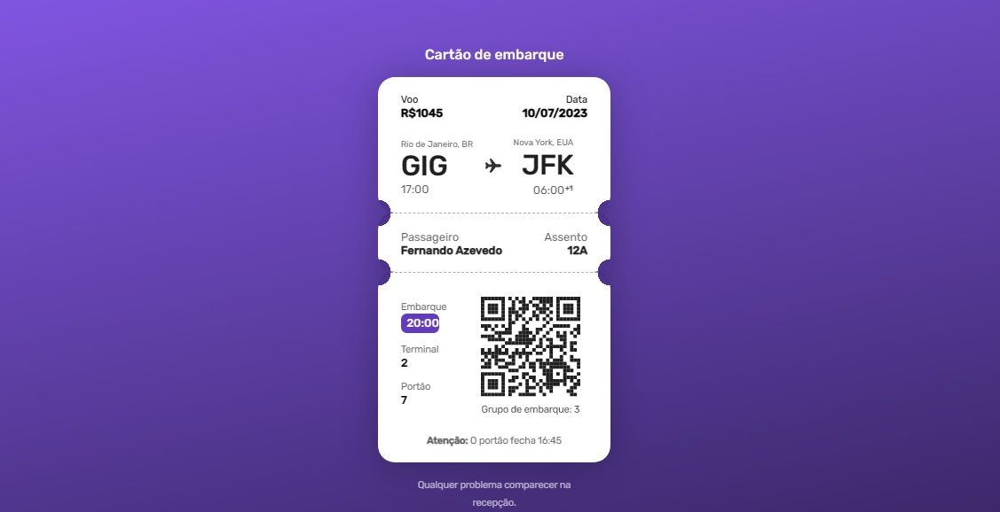

<h1 align="center"> Boarding Pass </h1>

Programa exclusivo e gratuito, promovido pela Rocketseat para ensino no #BoraCodar.  

  <a href="#-tecnologias">Tecnologias</a>&nbsp;&nbsp;&nbsp;|&nbsp;&nbsp;&nbsp;
  <a href="#-projeto">Projeto</a>&nbsp;&nbsp;&nbsp;|&nbsp;&nbsp;&nbsp;
  <a href="#-layout">Layout</a>&nbsp;&nbsp;&nbsp;|&nbsp;&nbsp;&nbsp;
  <a href="#memo-licença">Licença</a>

  

 

  

## 🚀 Tecnologias

Esse projeto foi desenvolvido com as seguintes tecnologias:

- HTML e CSS
- Git e Github
- Figma

## 💻 Projeto

Boarding Pass é um projeto que simula uma passagem de voo.

- [Acesse o projeto finalizado, online](https://fernandoaz89.github.io/boardingPass/)

## 🔖 Layout

Você pode visualizar o layout do projeto através [DESSE LINK](https://www.figma.com/file/vUlrklbndgPaEmBJ9NNyPX/%23boraCodar---Desafio-6-(Community)?node-id=1%3A7&t=HUvvo5NbLn7nSHYB-0). É necessário ter conta no [Figma](https://figma.com) para acessá-lo.

## 📝 Licença

Esse projeto está sob a licença MIT.

Feito com ♥ by Rocketseat :wave: [Participe da nossa comunidade!](https://discord.gg/rocketseat)

